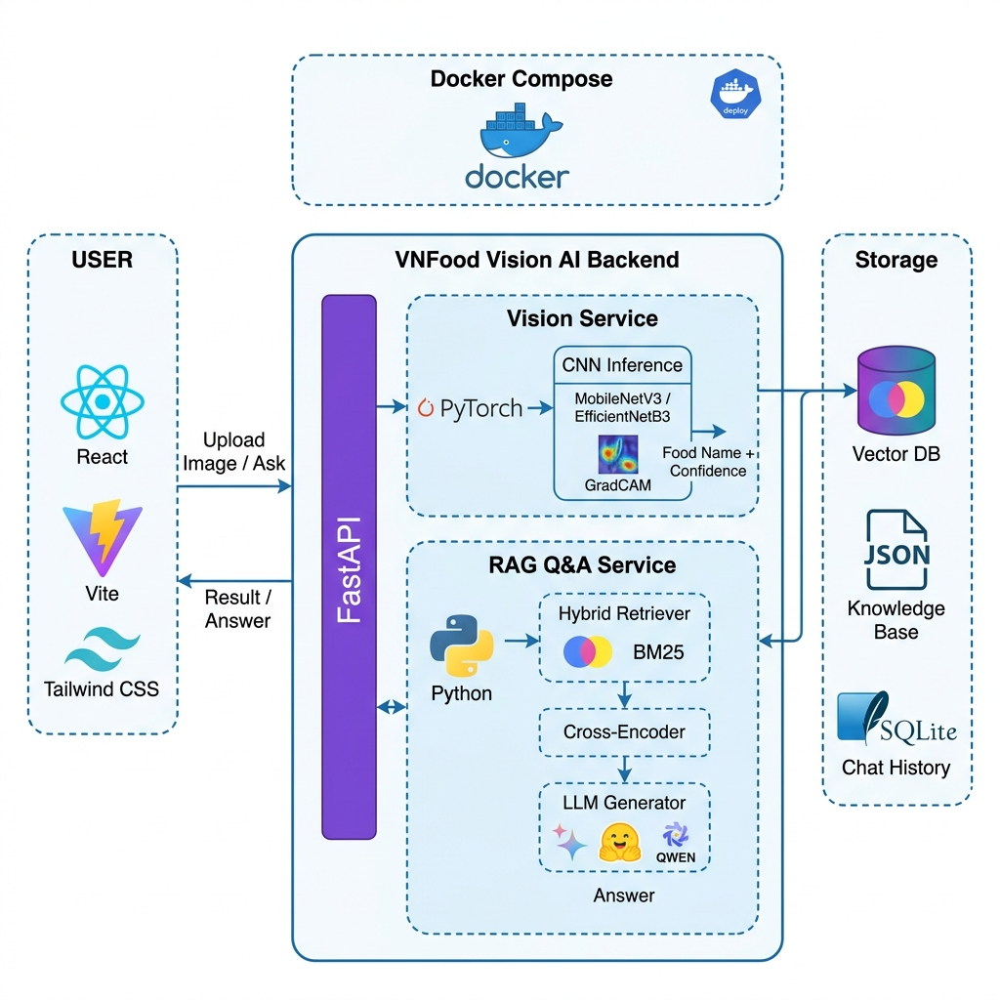

<h1 align="center">🍜 VNFood Vision AI</h1>

<p align="center">
  <strong>Hệ thống nhận diện và tư vấn ẩm thực Việt Nam tích hợp Computer Vision & RAG-LLM</strong>
</p>

<p align="center">
  
  
  
  
</p>

---

## 📖 Bối cảnh & Mục tiêu

Việt Nam sở hữu một nền ẩm thực phong phú với hàng trăm món ăn truyền thống, nhưng hiện chưa có một công cụ thông minh nào có thể nhận diện và giải thích đầy đủ về chúng. **VNFood Vision AI** được xây dựng nhằm giải quyết bài toán này thông qua sự kết hợp của hai hướng công nghệ:

1. **Computer Vision (Thị giác Máy tính)** — Nhận diện món ăn qua hình ảnh bằng các mạng CNN được fine-tune trên bộ dữ liệu ẩm thực Việt Nam tự thu thập (40+ class).
2. **RAG-LLM (Hỏi đáp Có Ngữ cảnh)** — Tích hợp cơ sở tri thức ẩm thực vào một mô hình ngôn ngữ lớn để trả lời chuyên sâu về công thức, dinh dưỡng, và văn hóa ẩm thực.

Sản phẩm cuối là một **Web Application** cho phép người dùng tải ảnh món ăn lên, xem kết quả nhận diện, phân tích dinh dưỡng theo thời gian thực, và trò chuyện với một trợ lý ảo chuyên ẩm thực.

---

## 🏗️ Kiến trúc Hệ thống

<p align="center">
  
</p>

### Luồng xử lý chính

**Nhận diện ảnh (POST `/analyze-food`)**
```
Ảnh Base64 từ User
       ↓
 Decode → Temp File
       ↓
 PyTorch CNN Inference (MobileNetV3 / EfficientNetB3)
       ↓
 Class Label (vd: "bun_bo_hue") → Tên tiếng Việt
       ↓
 RAG Retriever: Tìm 3 tài liệu liên quan nhất từ ChromaDB
       ↓
 Trả về: Tên món, Độ tin cậy, Nguyên liệu, Gợi ý câu hỏi
```

**Chat RAG (POST `/chat-rag`)**
```
Câu hỏi của User
       ↓
 Detect Query Intent (nguyên liệu / công thức / dị ứng / dinh dưỡng…)
       ↓
 Hybrid Retrieval: Dense (ChromaDB) + Sparse (BM25-Okapi)
       ↓
 Cross-Encoder Reranker → Top-K tài liệu tốt nhất
       ↓
 LLM Generator (Gemini/Colab LoRA/Local) → Câu trả lời
```

---

## 🔬 Các Mô hình AI

### Vision (Nhận diện Hình ảnh)
| Backbone        | Tốc độ | Độ chính xác | Ghi chú              |
|-----------------|--------|--------------|----------------------|
| MobileNetV3-Large | ✅ Nhanh | Trung bình  | Mặc định (API)       |
| EfficientNet-B3 | ⚖️ Cân bằng | ✅ Cao    | Khuyến nghị dùng thực tế |
| ResNet50        | Trung bình | Trung bình | Baseline              |
| ConvNeXt-Tiny   | Chậm   | ✅ Cao        | Thí nghiệm           |

- **Dataset**: 40+ class món ăn Việt Nam, tự thu thập và gán nhãn bằng Selenium.
- **Kỹ thuật training**: Focal Loss, Label Smoothing, MixUp/CutMix, RandAugment, TTA.
- **Kỹ thuật giải thích**: GradCAM (Gradient-weighted Class Activation Mapping) để hiển thị vùng mô hình tập trung.

### RAG (Hỏi đáp Ngữ cảnh)
- **Embedding Model**: `paraphrase-multilingual-MiniLM-L12-v2` (Hỗ trợ tiếng Việt)
- **Retrieval**: Hybrid — ChromaDB (Vector/Dense) + BM25-Okapi (Sparse)
- **Reranker**: `cross-encoder/mmarco-mMiniLMv2-L12-H384-v1`
- **Knowledge Base**: File JSON tùy chỉnh chứa thông tin công thức, dinh dưỡng, văn hóa của các món ăn Việt Nam

### LLM (Mô hình Ngôn ngữ)
Hệ thống hỗ trợ 3 lựa chọn, chuyển đổi linh hoạt qua giao diện:
1. **Gemini 3.1 Flash Lite** (Mặc định) — Google API, không cần cài đặt thêm.
2. **Colab / Ngrok LoRA** — Kết nối tới mô hình đã fine-tune chạy trên Google Colab qua đường hầm Ngrok.
3. **Local Qwen 2.5** — Chạy hoàn toàn offline trên máy cá nhân.

---

## 🛠️ Công nghệ Sử dụng

| Lĩnh vực | Công cụ / Thư viện |
|---|---|
| **Frontend** | React 18, TypeScript, Vite, Tailwind CSS, Lucide Icons |
| **Backend** | FastAPI, Uvicorn, Pydantic, Python 3.10+ |
| **Vision AI** | PyTorch, Torchvision, OpenCV, Pillow |
| **RAG & LLM** | ChromaDB, Sentence-Transformers, rank-bm25, Google Generative AI |
| **Fine-tuning** | Transformers (HuggingFace), LoRA/QLoRA trên Colab |
| **Tracking** | Weights & Biases (W&B) |
| **Data** | Selenium, BeautifulSoup, Pandas, NumPy |
| **Triển khai** | Docker, Docker Compose |

---

## 🚀 Hướng dẫn Cài đặt & Chạy

### Yêu cầu Hệ thống
- Python **3.10+**
- Node.js **18+**
- (Tùy chọn) GPU CUDA để tăng tốc inference

### Bước 1: Clone dự án
```bash
git clone https://github.com/your-username/vnfood_vision.git
cd vnfood_vision
```

### Bước 2: Cài đặt Backend
```bash
# Cài đặt thư viện Python
pip install -r requirements.txt

# Tạo file cấu hình môi trường
cp .env.example .env
```

Mở file `.env` và điền thông tin:
```env
# BẮT BUỘC: API Key của Gemini (dùng làm LLM mặc định)
GEMINI_API_KEY=YOUR_GEMINI_API_KEY

# TÙY CHỌN: Dùng mô hình fine-tune qua Google Colab
COLAB_LLM_URL=https://xxxx-xx-xx-xx.ngrok-free.app

# TÙY CHỌN: Dùng mô hình LLM chạy offline trên máy
LOCAL_LLM_PATH=/path/to/your/local/llm
```

> **Lấy Gemini API Key miễn phí** tại: https://aistudio.google.com/app/apikey

### Bước 3: Chạy Backend (FastAPI)
```bash
python -m uvicorn backend.main:app --reload --port 8888
```
API sẽ khởi động tại: `http://localhost:8888`  
Tài liệu API tương tác (Swagger UI): `http://localhost:8888/docs`

### Bước 4: Cài đặt & Chạy Frontend
Mở một terminal mới:
```bash
cd frontend
npm install
npm run dev
```
Giao diện web sẽ có sẵn tại: **`http://localhost:5173`** 🎉

---

## 📁 Cấu trúc Thư mục

```
vnfood_vision/
│
├── 📂 backend/                  # Server FastAPI
│   ├── 📂 api/                  # Các API Router
│   │   ├── rag.py               # /analyze-food, /chat-rag, /tts
│   │   ├── history.py           # /history CRUD
│   │   ├── analytics.py         # /analytics/stats
│   │   ├── settings.py          # /settings/update (NEW)
│   │   └── places.py            # /places (Google Maps)
│   ├── 📂 core/
│   │   ├── rag_service.py       # Orchestrator chính
│   │   └── global_settings.py   # Config động In-memory (NEW)
│   └── main.py                  # Khởi tạo FastAPI App
│
├── 📂 src/                      # Mã nguồn AI cốt lõi
│   ├── 📂 vision/
│   │   ├── model.py             # Kiến trúc CNN (EfficientNet, MobileNet…)
│   │   ├── train.py             # Pipeline training
│   │   ├── inference.py         # Inference + TTA
│   │   └── gradcam.py           # Giải thích bằng GradCAM
│   └── 📂 rag/
│       ├── rag_retriever.py     # Hybrid Retrieval (Dense + BM25 + Reranker)
│       ├── rag_generator.py     # LLM Generator (Gemini/Colab/Local)
│       ├── rag_index.py         # Xây dựng ChromaDB index
│       └── data_prep_rag.py     # Tiền xử lý dữ liệu RAG
│
├── 📂 frontend/                 # Giao diện React
│   └── 📂 src/
│       ├── 📂 components/       # Các UI Component
│       │   ├── ChatInterface.tsx    # Giao diện Chat RAG
│       │   ├── ImagePreview.tsx     # Xem ảnh + GradCAM
│       │   ├── NutritionPanel.tsx   # Bảng dinh dưỡng
│       │   ├── HistoryView.tsx      # Lịch sử phân tích
│       │   ├── AnalyticsView.tsx    # Thống kê hệ thống
│       │   └── SettingsView.tsx     # Cài đặt mô hình AI
│       ├── hooks/useAppLogic.ts # Logic nghiệp vụ chính
│       └── services/api.ts      # HTTP Client gọi Backend
│
├── 📂 notebooks/                # Jupyter Notebooks thực nghiệm
│   ├── 00_crawler.ipynb         # Thu thập dữ liệu ảnh
│   ├── 01_eda.ipynb             # Phân tích dữ liệu
│   ├── 04_train_pipeline.ipynb  # Huấn luyện MobileNetV3
│   ├── 04_train_pipeline_efficientnet.ipynb  # Huấn luyện EfficientNet-B3
│   ├── 05_evaluate.ipynb        # Đánh giá mô hình
│   └── 05_llm_finetune.ipynb    # Fine-tune LLM (LoRA)
│
├── 📂 checkpoints/              # Trọng số mô hình (.pth)
│   ├── mobilenet_v3_large/
│   ├── efficientnet_b3/
│   ├── resnet50/
│   └── convnext_tiny/
│
├── 📂 configs/
│   └── config.yaml              # Cấu hình training & inference
│
├── .env.example                 # Mẫu biến môi trường
├── requirements.txt             # Thư viện Python
└── docker-compose.yml           # Triển khai Docker
```

---

## 🐳 Triển khai với Docker (Tùy chọn)

```bash
# Build và chạy toàn bộ hệ thống (Backend + Frontend)
docker-compose up --build
```

---

## 🔧 Cấu hình Mô hình AI Động

Sau khi cả hai server đang chạy, bạn có thể chuyển đổi mô hình mà **không cần khởi động lại** qua giao diện web:

1. Mở **Tab Cấu hình (Settings)** trên thanh sidebar.
2. Chọn **Vision Backbone** (MobileNetV3 cho tốc độ / EfficientNetB3 cho độ chính xác).
3. Chọn **LLM Engine** (Gemini / Colab LoRA / Local).
4. Nhấn **"Lưu Cấu Hình"** — Backend sẽ cập nhật ngay lập tức.

> ⚠️ Để dùng Colab LoRA, bạn cần chạy notebook `05_llm_finetune.ipynb` trên Google Colab, bật Ngrok, rồi dán link vào biến `COLAB_LLM_URL` trong file `.env`.

---

<div align="center">
  <i>Được phát triển trong khuôn khổ môn học Nhập môn Học máy — Trường Đại học Khoa học Tự Nhiên 🇻🇳</i>
</div>